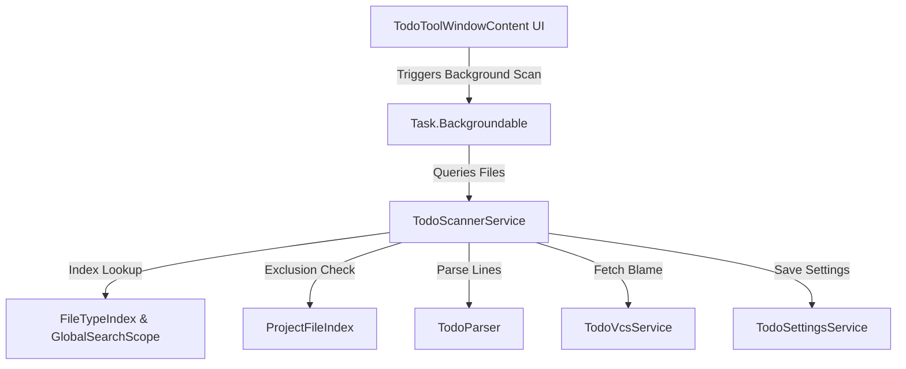

# AI-DLC Phase 2: System Architecture

**Project**: TODO++  
**Component**: IntelliJ Platform Plugin Architecture  
**Status**: APPROVED  

---

## 🏗️ Architectural Overview

---

## 🧩 Architectural Components

### 1. TodoScannerService (`com.todoplus.services.TodoScannerService`)
- **Scope**: Project-level service (`@Service(Service.Level.PROJECT)`).
- **Responsibilities**:
  - Locates candidate files via `FileTypeIndex.getFiles(fileType, scope)`.
  - Filters out files excluded by `ProjectFileIndex.isExcluded(file)` or user `ignoredDirectories`.
  - Enforces `maxFileSizeMb` checks to prevent out-of-memory crashes.
  - Reads PSI text in `runReadAction` (editor buffer for unsaved changes) or disk bytes fallback.
  - Streams progress updates via `ProgressIndicator`.

### 2. TodoSettingsService (`com.todoplus.settings.TodoSettingsService`)
- **Scope**: Persistent state component (`@State`, `PersistentStateComponent<State>`).
- **Responsibilities**:
  - Persists custom priority levels, colors, custom keywords, issue URL templates, ignored directories, and max file size limits in `todoPlus_settings.xml`.

### 3. TodoToolWindowContent (`com.todoplus.toolwindow.TodoToolWindowContent`)
- **Scope**: Tool Window Content UI Panel (`SimpleToolWindowPanel`, `TreeTable`).
- **Responsibilities**:
  - Manages action toolbars, scope selection, filter fields, priority dropdowns, and status labels.
  - Dispatches background scanning tasks via `ProgressManager.getInstance().run(Task.Backgroundable)`.

### 4. TodoVcsService (`com.todoplus.services.vcs.TodoVcsService`)
- **Scope**: Version Control Blame Service.
- **Responsibilities**:
  - Queries Git/VCS annotations outside `runReadAction` locks to prevent UI thread deadlocks.

### 5. IssueExporterService (`com.todoplus.services.integration.IssueExporterService`)
- **Scope**: Integration Service for Issue Tracker REST APIs.
- **Responsibilities**:
  - Issues non-blocking HTTP `POST` requests to GitHub Issues API (`/repos/{owner}/{repo}/issues`) and Jira REST API (`/rest/api/3/issue`).
  - Handles token authentication, JSON payloads, and returns creation response status and issue web URLs.

### 6. WebhookNotificationService (`com.todoplus.services.integration.WebhookNotificationService`)
- **Scope**: Outbound Webhook Service.
- **Responsibilities**:
  - Formats overdue tasks into Slack Block Kit and Discord Rich Embed JSON payloads.
  - Dispatches non-blocking POST requests to configured webhook endpoints.

---

## 🔐 Threading & Concurrency Constraints

1. **Read Action Locks**:
   - `FileTypeIndex` queries and `PsiManager.findFile(file)` MUST run inside `ApplicationManager.getApplication().runReadAction(...)`.
2. **Event Dispatch Thread (EDT)**:
   - UI tree rebuilds and statistics label updates MUST run on EDT via `ApplicationManager.getApplication().invokeLater { ... }`.
3. **Background Execution**:
   - All full-project or file scanning tasks run inside `Task.Backgroundable` on background threads.
