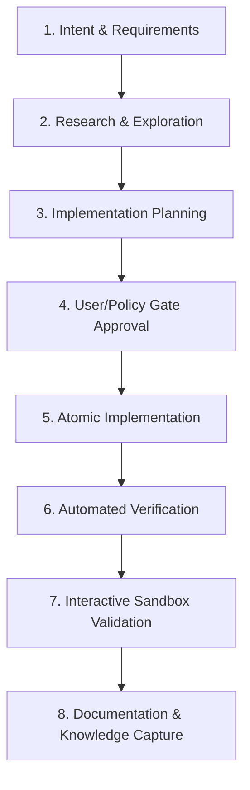

# AI-Driven Development Life Cycle (AIDLC) Guide

This guide documents the **AI-Driven Development Life Cycle (AIDLC)** methodology applied in the **TODO++** project. It is fully compliant with the official **[AWS AI-DLC 2.0 Workflows specification](https://github.com/awslabs/aidlc-workflows)** (`awslabs/aidlc-workflows`).

---

## 🏛️ AWS AI-DLC 2.0 Repository Integration

This repository implements the official AWS AI-DLC 2.0 adaptive steering and document artifact structure:

- **[AGENTS.md](file:///Users/prasadvennam/MY%20WORK/IDEA-PROJECTS/TODO-plus/AGENTS.md)**: Workspace steering file configuring AI agent tenets, phase gates, and IntelliJ Platform SDK engineering constraints.
- **[aidlc-rules/core-workflow.md](file:///Users/prasadvennam/MY%20WORK/IDEA-PROJECTS/TODO-plus/aidlc-rules/core-workflow.md)**: Core AWS AI-DLC 2.0 workflow steering rules.
- **[aidlc-rule-details/](file:///Users/prasadvennam/MY%20WORK/IDEA-PROJECTS/TODO-plus/aidlc-rule-details/)** (and `.aidlc-rule-details/`): Modular phase detail rules (`common/`, `inception/`, `construction/`, `operations/`, `extensions/`).
- **`aidlc-docs/`**: Centralized folder storing all workspace development phase artifacts:
  - **[aidlc-docs/requirements/REQUIREMENTS.md](file:///Users/prasadvennam/MY%20WORK/IDEA-PROJECTS/TODO-plus/aidlc-docs/requirements/REQUIREMENTS.md)** (Phase 1: Inception & Alignment)
  - **[aidlc-docs/architecture/SYSTEM_ARCHITECTURE.md](file:///Users/prasadvennam/MY%20WORK/IDEA-PROJECTS/TODO-plus/aidlc-docs/architecture/SYSTEM_ARCHITECTURE.md)** (Phase 2: Architecture)
  - **[aidlc-docs/design/COMPONENT_DESIGN.md](file:///Users/prasadvennam/MY%20WORK/IDEA-PROJECTS/TODO-plus/aidlc-docs/design/COMPONENT_DESIGN.md)** (Phase 2: Component Detailed Design)
  - **[aidlc-docs/tasks/IMPLEMENTATION_TASKS.md](file:///Users/prasadvennam/MY%20WORK/IDEA-PROJECTS/TODO-plus/aidlc-docs/tasks/IMPLEMENTATION_TASKS.md)** (Phase 3: Execution & Task Tracking)
  - **[aidlc-docs/verification/VERIFICATION_REPORT.md](file:///Users/prasadvennam/MY%20WORK/IDEA-PROJECTS/TODO-plus/aidlc-docs/verification/VERIFICATION_REPORT.md)** (Phase 3: Automated Verification Evidence)

---

## 🔄 Core AIDLC Phases



### Phase 1: Intent & Requirements Gathering
- **Objective**: Establish precise quantitative boundaries, architectural intent, and target constraints.
- **Rules**: Clarify underspecified requirements early. Do not make unverified assumptions about API contracts or dependencies.

### Phase 2: Research & Exploration
- **Objective**: Inspect existing code structure, types, and services before proposing changes.
- **Rules**:
  - Read authoritative source code files (`TodoScannerService.kt`, `TodoSettingsService.kt`, `TodoToolWindowContent.kt`).
  - Check existing tests and build configurations (`build.gradle.kts`).
  - Do NOT modify code during exploration.

### Phase 3: Implementation Planning
- **Objective**: Create a structured `implementation_plan.md` artifact detailing:
  - User review items & open questions
  - Affected components and file diff summaries (`[MODIFY]`, `[NEW]`, `[DELETE]`)
  - Automated & manual verification steps

### Phase 4: User / Policy Approval Gate
- **Objective**: Ensure the developer aligns with proposed changes, breaking adjustments, or scope.
- **Rules**: Wait for explicit or review policy approval before making mutations.

### Phase 5: Atomic & Defensive Implementation
- **Objective**: Execute code edits cleanly, adhering to zero superficial patches.
- **Rules**:
  - Preserve existing API contracts and docstrings.
  - Implement defensive checks (e.g. non-null checks, bounds checks, file size caps).
  - Handle cross-platform differences (Windows `\` vs Unix `/`).

### Phase 6: Automated Verification
- **Objective**: Prove correctness with concrete build and test evidence.
- **Commands**:
  ```bash
  ./gradlew test         # Execute unit test suite
  ./gradlew buildPlugin  # Validate plugin artifact build & zero warnings
  ```

### Phase 7: Interactive Sandbox Validation
- **Objective**: Test UX, background threads, and UI components in a real IDE instance.
- **Command**:
  ```bash
  ./gradlew runIde       # Launches IntelliJ IDEA Community Sandbox with TODO++ installed
  ```

### Phase 8: Documentation & Knowledge Capture
- **Objective**: Update documentation and changelogs to reflect new capabilities.
- **Files**:
  - `CHANGELOG.md`
  - `README.md`
  - `USAGE.md`
  - `docs/AIDLC_GUIDE.md`

---

## 🛠️ JetBrains Plugin AIDLC Best Practices

1. **Threading & Lock Safety**:
   - Run PSI and VFS reads strictly inside `runReadAction`.
   - Perform expensive network/VCS operations outside `runReadAction` to prevent UI thread lockups.
2. **Performance & Scalability**:
   - Utilize native `ProjectFileIndex` to skip excluded files.
   - Enforce hard ceiling file size limits (`maxFileSizeMb`).
   - Stream background progress using `ProgressIndicator` (`indicator.fraction`, `indicator.text2`).
3. **Continuous Compatibility**:
   - Zero deprecated API usage; verify against target IntelliJ versions (`IC-2024.1`).
